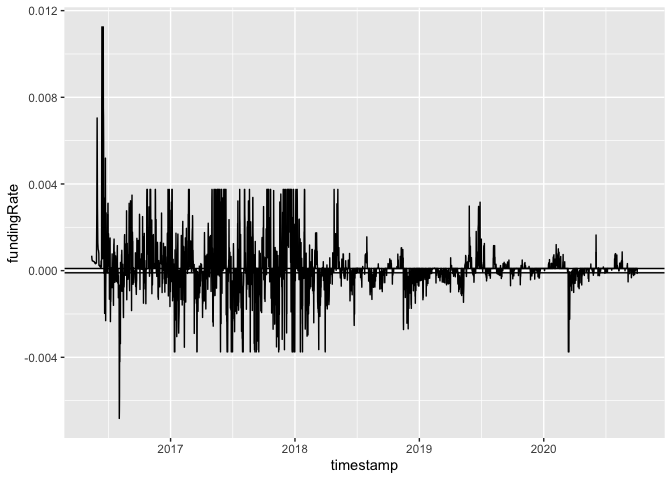

EDA
================
Neeraj Sharma
10/1/2020

``` r
data %>%
  mutate(above = if_else(fundingRate > 0.0001, 1, 
                        if_else(fundingRate < -0.0001, -1, 0))) %>%
  ggplot(aes(x = timestamp, y = fundingRate)) + 
  geom_line() + 
  geom_hline(yintercept = -0.0001) + 
  geom_hline(yintercept = 0.0001)
```

<!-- -->
