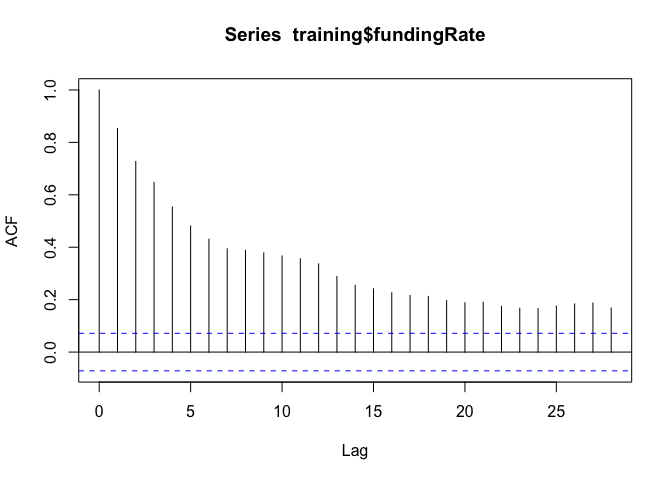

EDA
================
Neeraj Sharma
10/1/2020

``` r
running_size <- data %>%
  mutate(signal = if_else(fundingRate > 0.0001, 1, 
                          if_else(fundingRate < -0.0001, -1, 0))) %>%
  group_by(rleid(signal)) %>%
  mutate(cum = signal*cumsum(fundingRate)) %>%
  ungroup()
```

``` r
data %>%
  mutate(above = if_else(fundingRate > 0.0001, 1, 
                        if_else(fundingRate < -0.0001, -1, 0))) %>%
  ggplot(aes(x = timestamp, y = fundingRate)) + 
  geom_line() + 
  geom_hline(yintercept = -0.0001) + 
  geom_hline(yintercept = 0.0001) + 
  labs(title = "Lifetime Funding Rate Data Plotted")
```

<!-- -->

``` r
ytd2019 <- running_size %>%
  filter(timestamp < ymd_hms("2020-01-01 00:00:00", tz = "US/Eastern"),
         timestamp >= ymd_hms("2019-01-01 00:00:00", tz = "US/Eastern"))

ar <- arima(ytd2019$fundingRate, order = c(3, 0, 15))
resids <- residuals(ar)

fit <- ytd2019$fundingRate - resids

fitted <- tibble(timestamp = ytd2019$timestamp, values = fit)

ggplot() + 
  geom_line(ytd2019, mapping = aes(timestamp, fundingRate)) + 
  geom_line(fitted, mapping = aes(timestamp, values), color = "green") + 
  labs(title = "Historic Funding Data for 2019 with Model Fitted")
```

<!-- -->

Lets see how the model fairs out of sample

``` r
abbv_ytd2020 <- running_size %>%
  filter(timestamp <= ymd_hms("2020-01-07 20:00:00", tz = "US/Eastern"),
         timestamp >= ymd_hms("2020-01-01 00:00:00", tz = "US/Eastern"))


prediction <- predict(ar, n.ahead = 20)
forecasted <- tibble(timestamp = abbv_ytd2020$timestamp[1:20], pred = prediction[["pred"]] %>% as.numeric())

ggplot() + 
  geom_line(bind_rows(ytd2019 %>% filter(timestamp >= ymd_hms("2019-12-17 04:00:00", tz = "US/Eastern")), abbv_ytd2020), mapping = aes(timestamp, fundingRate)) + 
  geom_line(fitted %>% filter(timestamp >= ymd_hms("2019-12-17 04:00:00", tz = "US/Eastern")), mapping = aes(timestamp, values), color = "green") + 
  geom_line(forecasted, mapping = aes(timestamp, pred), color = "red") + 
  labs(title = "Zoomed in on Out of Sample prediction", subtitle = "This is not interesting because I don't have volatility. Need to pick a better sample.")
```

<!-- -->

Let me try this attempt to predict right at the beginning of a period of
volatility

``` r
ytd2020 <- running_size %>%
  filter(timestamp >= ymd_hms("2020-01-01 00:00:00", tz = "US/Eastern"))

ggplot(ytd2020, aes(timestamp, fundingRate)) + 
  geom_line() + 
  labs(title = "Historic Funding Rate for 2020", subtitle = "Lets specifically analyze the period beginning on 2020-09-07 04:00:00") + 
  annotate("text", x = ymd_hms("2020-09-07 04:00:00"), y = -0.001, label = "2020-09-07 04:00:00") + 
  annotate("point", x = ymd_hms("2020-09-07 04:00:00"), y = -0.00075)
```

<!-- -->

Here is a model that is fit up until 2020-09-07 04:00:00. We will use
this to predict the next 40 funding periods and see what happens.

``` r
training <- ytd2020 %>%
  filter(timestamp < ymd_hms("2020-09-07 04:00:00"))

testing <- ytd2020 %>%
  filter(timestamp >= ymd_hms("2020-09-07 04:00:00"))

# Lets fit some models
acf(training$fundingRate)
```

<!-- -->

``` r
pacf(training$fundingRate)
```

<!-- -->
