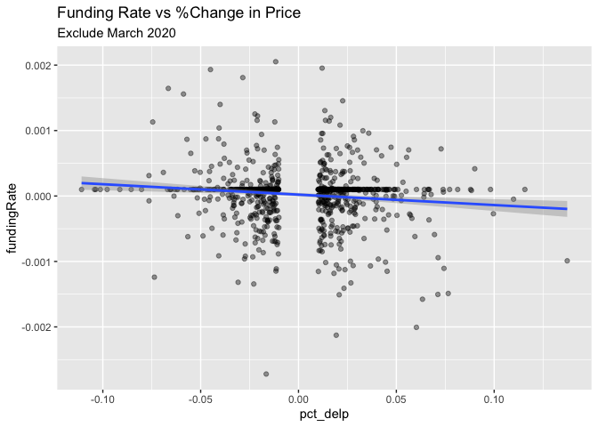
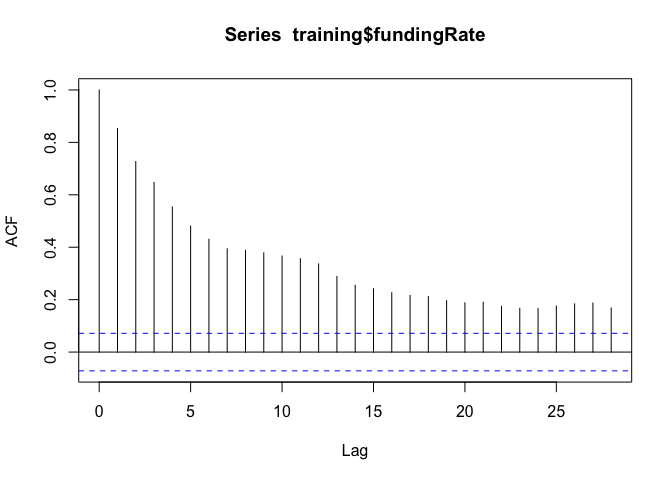
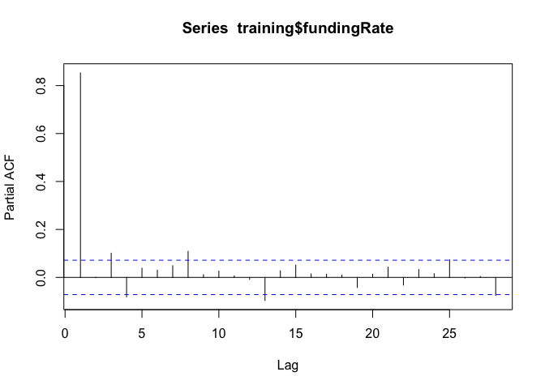

EDA
================
Neeraj Sharma
10/1/2020

# KEY FINDINGS

The median duration of deviation for the funding rate data is 3 for both
above and below. However, the mean length of deviation is considerably
higher for positive swings; 5.8 versus 4.9. Furthermore, there appear to
be considerably more periods of negative funding than positve funding
(291 vs 199); a difference of 92 periods. This implies that the price of
swaps exceeds the spot price of bitcoin more than the converse.

In terms of projecting the cumulative returns to funding, it appears
that positive funding periods return more than negative funding periods.
The coefficient for time in the positive funding regression is 0.0019147
while the coefficient for the negative funding regression is -0.0013052.
Furthermore, the median cumulative funding return is considerably higher
for positive funding periods compared to negative funding periods.

Finally, all things considered, I find that funding periods are
generally extremely short lived. Based on visual analysis of the
distributions of funding history lengths, funding is likely to last only
for 1 period. However, by modeling using a distribution function which
likely provides a closer upper bound on the true likelihood indicates
that positive funding tends to last longer than negative
funding.

## When the funding rate deviates from +1bps either below or above, how long did it take for the funding rate to revert back to +1bps when it was below and how long did it take when it was above.

I produce a dataframe that has signals for whenever we are +/- 0.0001
basis points and then count within these periods to get the length of
each period of deviation. This is a sample of the dataframe I produce.
Signal indicates if you are positive (1), negative (-1), or neutral (0).
Section counts increases every time signal changes, meaning it counts
the unique number of meaningful periods of funding. CSum is the
cumulative sum within a period of significant funding. ID counts the
position within a period of significant
funding.

| timestamp           | symbol | fundingInterval     | fundingRate | fundingRateDaily | signal | section |       csum | id |
| :------------------ | :----- | :------------------ | ----------: | ---------------: | -----: | ------: | ---------: | -: |
| 2020-11-01 20:00:00 | XBTUSD | 2000-01-01 08:00:00 |    0.000070 |         0.000210 |      0 |     570 |   0.000000 | NA |
| 2020-11-01 12:00:00 | XBTUSD | 2000-01-01 08:00:00 |  \-0.000045 |       \-0.000135 |      0 |     570 |   0.000000 | NA |
| 2020-11-01 04:00:00 | XBTUSD | 2000-01-01 08:00:00 |    0.000100 |         0.000300 |      0 |     570 |   0.000000 | NA |
| 2020-10-31 20:00:00 | XBTUSD | 2000-01-01 08:00:00 |    0.000100 |         0.000300 |      0 |     570 |   0.000000 | NA |
| 2020-10-31 12:00:00 | XBTUSD | 2000-01-01 08:00:00 |    0.000077 |         0.000231 |      0 |     570 |   0.000000 | NA |
| 2020-10-31 04:00:00 | XBTUSD | 2000-01-01 08:00:00 |    0.000019 |         0.000057 |      0 |     570 |   0.000000 | NA |
| 2020-10-30 20:00:00 | XBTUSD | 2000-01-01 08:00:00 |    0.000100 |         0.000300 |      0 |     570 |   0.000000 | NA |
| 2020-10-30 12:00:00 | XBTUSD | 2000-01-01 08:00:00 |    0.000100 |         0.000300 |      0 |     570 |   0.000000 | NA |
| 2020-10-30 04:00:00 | XBTUSD | 2000-01-01 08:00:00 |    0.000020 |         0.000060 |      0 |     570 |   0.000000 | NA |
| 2020-10-29 20:00:00 | XBTUSD | 2000-01-01 08:00:00 |    0.000100 |         0.000300 |      0 |     570 |   0.000000 | NA |
| 2020-10-29 12:00:00 | XBTUSD | 2000-01-01 08:00:00 |  \-0.000214 |       \-0.000642 |    \-1 |     569 | \-0.000214 |  1 |

Here are a couple of visualization that examine this more
closely.

<!-- --><!-- --><!-- -->

Here are some of the summary stats on reversion in each direction

| signal |     mean | med |    stdev | number of unique periods |
| -----: | -------: | --: | -------: | -----------------------: |
|    \-1 | 3.897747 |   2 | 3.853427 |                      187 |
|      1 | 5.904372 |   3 | 6.663672 |                       98 |

## What is the cumulative funding rate? Sum of the funding rates when cumulative days above or below 1?

Aggregate funding rate throughout all history.

<!-- -->

<!-- -->

<!-- -->

| term        |    estimate | std.error |  statistic | p.value |
| :---------- | ----------: | --------: | ---------: | ------: |
| (Intercept) | \-0.0007849 | 0.0001341 | \-5.851708 |       0 |
| id          |   0.0007577 | 0.0000151 |  50.253749 |       0 |

<!-- -->

| term        |    estimate | std.error |   statistic |   p.value |
| :---------- | ----------: | --------: | ----------: | --------: |
| (Intercept) |   0.0005834 | 0.0001518 |    3.842205 | 0.0001355 |
| id          | \-0.0008248 | 0.0000277 | \-29.762635 | 0.0000000 |

Summary stats of cumulative returns in terms of value of the cumulative
return.

| signal |        mean |        min |         med |        max |     stdev |
| -----: | ----------: | ---------: | ----------: | ---------: | --------: |
|    \-1 | \-0.0026316 | \-0.028029 | \-0.0009650 | \-0.000101 | 0.0040816 |
|      1 |   0.0036890 |   0.000102 |   0.0011655 |   0.030218 | 0.0054009 |

## 3\. What is the likelihood of funding rate deviating from 1 again in the next 1 period

I want P(FR\_t+1 \> 0.0001 | FR\_t \> 0.0001). Alternatively, fit a
poisson distribution, but the issue here is that we are not
independently generated. If a event occured in t, it is likely it
occured in t+1 it seems based on investor behavior. My research says
that modeling these events with a poisson distribution yields an
upper-bound approximation for the true distribution. That is still
insightful, given the distribution of the data clearly lends itself to 1
period being the highest likelyhood of deviation
duration.

<!-- --><!-- -->

To get a middle and lower bound, your answer is just 1 by gut checking
the data above.

## Funding rate and price data analysis

we want to answer the question, if prices move by x%, funding rate moves
by y% in n periods so funding is left hand and prices is RHS. The other
way around would be easier to model because I could use a build a factor
model against a crypto index. That would be somthing like:

\[
r_{swap,t} - r_f = \beta_0 + \beta_1\left(r_{index, t} - r_f\right) + \beta_2\left(\text{funding}_t\right) + \varepsilon_t
\]

Funding is already a rate so it wouldn’t be converted to a return
because it is already a reurn series. If you believe that the retu

However, simple
    approach:

    ## Warning: Removed 1 rows containing non-finite values (stat_smooth).

    ## Warning: Removed 1 rows containing missing values (geom_point).

<!-- --><!-- --><!-- -->

    ## 
    ## Call:
    ## lm(formula = fundingRate ~ pct_delp, data = full_df)
    ## 
    ## Residuals:
    ##        Min         1Q     Median         3Q        Max 
    ## -0.0038168 -0.0000696  0.0000832  0.0001024  0.0031650 
    ## 
    ## Coefficients:
    ##               Estimate Std. Error t value Pr(>|t|)    
    ## (Intercept)  9.509e-06  8.380e-06   1.135    0.257    
    ## pct_delp    -1.589e-03  3.994e-04  -3.979 7.11e-05 ***
    ## ---
    ## Signif. codes:  0 '***' 0.001 '**' 0.01 '*' 0.05 '.' 0.1 ' ' 1
    ## 
    ## Residual standard error: 0.0004306 on 2640 degrees of freedom
    ## Multiple R-squared:  0.005961,   Adjusted R-squared:  0.005585 
    ## F-statistic: 15.83 on 1 and 2640 DF,  p-value: 7.106e-05

## Other random exploration

<!-- -->

<!-- -->

Lets see how the model fairs out of sample

<!-- -->

Let me try this attempt to predict right at the beginning of a period of
volatility

<!-- -->

Here is a model that is fit up until 2020-09-07 04:00:00. We will use
this to predict the next 40 funding periods and see what
happens.

<!-- --><!-- -->
