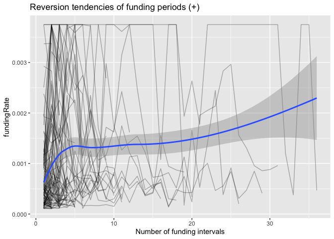
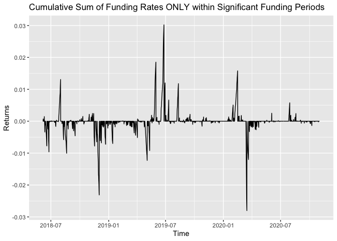
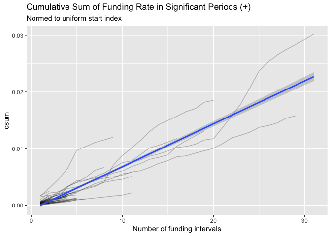
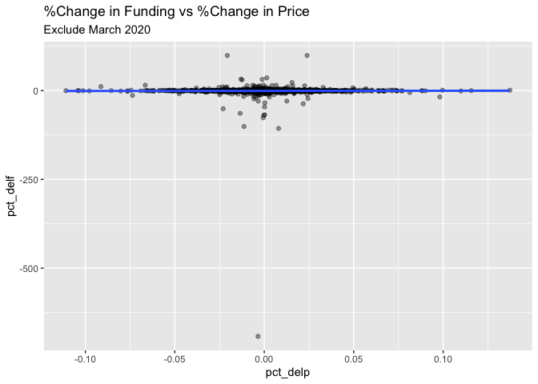

EDA
================
Neeraj Sharma
10/1/2020

## When the funding rate deviates from +1bps either below or above, how long did it take for the funding rate to revert back to +1bps when it was below and how long did it take when it was above

I produce a dataframe that has signals for whenever we are +/1 0.0001 on
the funding rate and then count within the periods to get the period of
reversion for each instance.

``` r
running_size <- data %>%
  filter(timestamp > ymd_hms("2017-06-01 04:00:00", tz = "US/Eastern")) %>%
  mutate(signal = if_else(fundingRate > 0.0001, 1, if_else(fundingRate < -0.0001, -1, 0)),
         section = rleid(signal)) %>%
  group_by(section) %>%
  mutate(csum = cumsum(fundingRate),
         csum = if_else(signal == 0, 0, csum),
         id = row_number(),
         id = ifelse(signal == 0, NA, id)) %>%
  arrange(desc(row_number())) %>%
  ungroup()
```

Check out how the id column counts each time we enter a period of
significant funding.

``` r
running_size %>%
  head(10) %>%
  kable()
```

| timestamp           | symbol | fundingInterval     | fundingRate | fundingRateDaily | signal | section |       csum | id |
| :------------------ | :----- | :------------------ | ----------: | ---------------: | -----: | ------: | ---------: | -: |
| 2020-10-19 20:00:00 | XBTUSD | 2000-01-01 08:00:00 |    0.000100 |         0.000300 |      0 |     930 |   0.000000 | NA |
| 2020-10-19 12:00:00 | XBTUSD | 2000-01-01 08:00:00 |    0.000083 |         0.000249 |      0 |     930 |   0.000000 | NA |
| 2020-10-19 04:00:00 | XBTUSD | 2000-01-01 08:00:00 |  \-0.000036 |       \-0.000108 |      0 |     930 |   0.000000 | NA |
| 2020-10-18 20:00:00 | XBTUSD | 2000-01-01 08:00:00 |    0.000008 |         0.000024 |      0 |     930 |   0.000000 | NA |
| 2020-10-18 12:00:00 | XBTUSD | 2000-01-01 08:00:00 |  \-0.000129 |       \-0.000387 |    \-1 |     929 | \-0.000129 |  1 |
| 2020-10-18 04:00:00 | XBTUSD | 2000-01-01 08:00:00 |  \-0.000074 |       \-0.000222 |      0 |     928 |   0.000000 | NA |
| 2020-10-17 20:00:00 | XBTUSD | 2000-01-01 08:00:00 |    0.000100 |         0.000300 |      0 |     928 |   0.000000 | NA |
| 2020-10-17 12:00:00 | XBTUSD | 2000-01-01 08:00:00 |  \-0.000038 |       \-0.000114 |      0 |     928 |   0.000000 | NA |
| 2020-10-17 04:00:00 | XBTUSD | 2000-01-01 08:00:00 |  \-0.000175 |       \-0.000525 |    \-1 |     927 | \-0.000175 |  1 |
| 2020-10-16 20:00:00 | XBTUSD | 2000-01-01 08:00:00 |    0.000067 |         0.000201 |      0 |     926 |   0.000000 | NA |

Here are a couple of visualization that examine this more closely.

``` r
ggplot(running_size) + 
  geom_line(aes(x = timestamp, y = csum, color = "Cumulative Sum")) + 
  geom_line(aes(x = timestamp, y = fundingRate, color = "Funding Rate")) + 
  labs(title = "Funding Rate and Cumulative Sum of Returns in Significant Funding Periods", x = "Time", y = "Returns", color = "") +
  theme(legend.position = "bottom")
```

<!-- -->

``` r
running_size %>%
  group_by(signal, section) %>%
  filter(signal != 0) %>%
  summarize(max = max(id)) %>%
  ggplot(aes(x = max)) + 
  geom_histogram(color = "black") + 
  labs(title = "Histogram of Duration of Funding Periods (-1bps/+1bps)") + 
  facet_wrap(~signal, scales = "free_x")
```

    ## `summarise()` regrouping output by 'signal' (override with `.groups` argument)

    ## `stat_bin()` using `bins = 30`. Pick better value with `binwidth`.

<!-- -->

``` r
#How should I model this?
running_size %>%
  filter(signal == 1) %>%
  ggplot() + 
  geom_line(mapping = aes(x = id, y = fundingRate, group = section), alpha = 0.3) + 
  geom_smooth(mapping = aes(x = id, y = fundingRate)) +
  labs(title = "Reversion tendencies of funding periods (+)", x = "Number of funding intervals")
```

    ## `geom_smooth()` using method = 'loess' and formula 'y ~ x'

<!-- -->

``` r
running_size %>%
  filter(signal == -1) %>%
  ggplot() + 
  geom_line(mapping = aes(x = id, y = fundingRate, group = section), alpha = 0.3) + 
  geom_smooth(mapping = aes(x = id, y = fundingRate)) +
  labs(title = "Reversion tendencies of funding periods (-)", x = "Number of funding intervals")
```

    ## `geom_smooth()` using method = 'loess' and formula 'y ~ x'

<!-- -->

Here are some of the summary stats on reversion in each direction

``` r
running_size %>%
  filter(signal != 0) %>%
  group_by(signal) %>%
  summarize(mean = mean(id), med = median(id), stdev = sd(id), count = n()) %>%
  kable()
```

    ## `summarise()` ungrouping output (override with `.groups` argument)

| signal |     mean | med |    stdev | count |
| -----: | -------: | --: | -------: | ----: |
|    \-1 | 3.970103 |   3 | 3.781184 |   970 |
|      1 | 5.799479 |   3 | 6.656316 |   768 |

## Other random exploration

``` r
data %>%
  mutate(above = if_else(fundingRate > 0.0001, 1, 
                        if_else(fundingRate < -0.0001, -1, 0))) %>%
  ggplot(aes(x = timestamp, y = fundingRate)) + 
  geom_line() + 
  geom_hline(yintercept = -0.0001) + 
  geom_hline(yintercept = 0.0001) + 
  labs(title = "Lifetime Funding Rate Data Plotted") 
```

<!-- -->

``` r
ytd2019 <- data %>%
  filter(timestamp < ymd_hms("2020-01-01 00:00:00", tz = "US/Eastern"),
         timestamp >= ymd_hms("2019-01-01 00:00:00", tz = "US/Eastern"))

ar <- arima(ytd2019$fundingRate, order = c(3, 0, 15))
resids <- residuals(ar)

fit <- ytd2019$fundingRate - resids

fitted <- tibble(timestamp = ytd2019$timestamp, values = fit)

ggplot() + 
  geom_line(ytd2019, mapping = aes(timestamp, fundingRate)) + 
  geom_line(fitted, mapping = aes(timestamp, values), color = "green") + 
  labs(title = "Historic Funding Data for 2019 with Model Fitted")
```

<!-- -->

Lets see how the model fairs out of sample

``` r
abbv_ytd2020 <- data %>%
  filter(timestamp <= ymd_hms("2020-01-07 20:00:00", tz = "US/Eastern"),
         timestamp >= ymd_hms("2020-01-01 00:00:00", tz = "US/Eastern"))


prediction <- predict(ar, n.ahead = 20)
forecasted <- tibble(timestamp = abbv_ytd2020$timestamp[1:20], pred = prediction[["pred"]] %>% as.numeric())

ggplot() + 
  geom_line(bind_rows(ytd2019 %>% filter(timestamp >= ymd_hms("2019-12-17 04:00:00", tz = "US/Eastern")), abbv_ytd2020), mapping = aes(timestamp, fundingRate)) + 
  geom_line(fitted %>% filter(timestamp >= ymd_hms("2019-12-17 04:00:00", tz = "US/Eastern")), mapping = aes(timestamp, values), color = "green") + 
  geom_line(forecasted, mapping = aes(timestamp, pred), color = "red") + 
  labs(title = "Zoomed in on Out of Sample prediction", subtitle = "This is not interesting because I don't have volatility. Need to pick a better sample.")
```

<!-- -->

Let me try this attempt to predict right at the beginning of a period of
volatility

``` r
ytd2020 <- data %>%
  filter(timestamp >= ymd_hms("2020-01-01 00:00:00", tz = "US/Eastern"))

ggplot(ytd2020, aes(timestamp, fundingRate)) + 
  geom_line() + 
  labs(title = "Historic Funding Rate for 2020", subtitle = "Lets specifically analyze the period beginning on 2020-09-07 04:00:00") + 
  annotate("text", x = ymd_hms("2020-09-07 04:00:00"), y = -0.001, label = "2020-09-07 04:00:00") + 
  annotate("point", x = ymd_hms("2020-09-07 04:00:00"), y = -0.00075)
```

<!-- -->

Here is a model that is fit up until 2020-09-07 04:00:00. We will use
this to predict the next 40 funding periods and see what happens.

``` r
training <- ytd2020 %>%
  filter(timestamp < ymd_hms("2020-09-07 04:00:00"))

testing <- ytd2020 %>%
  filter(timestamp >= ymd_hms("2020-09-07 04:00:00"))

# Lets fit some models
acf(training$fundingRate)
```

<!-- -->

``` r
pacf(training$fundingRate)
```

<!-- -->
