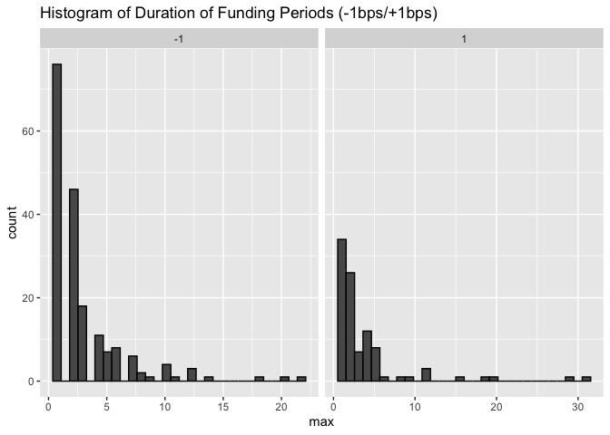
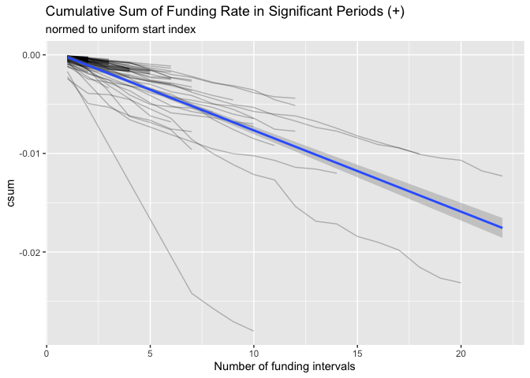
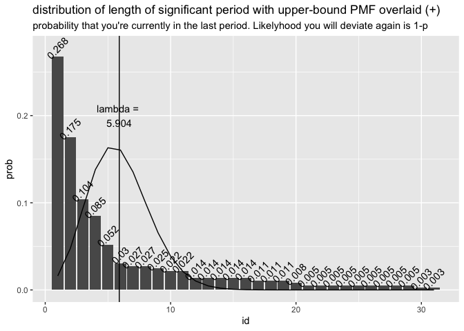

EDA
================
Neeraj Sharma
10/1/2020

# KEY FINDINGS

The median duration of deviation for the funding rate data is 3 for both
above and below. However, the mean is considerably higher
for

## When the funding rate deviates from +1bps either below or above, how long did it take for the funding rate to revert back to +1bps when it was below and how long did it take when it was above.

I produce a dataframe that has signals for whenever we are +/- 0.0001
basis points and then count within these periods to get the length of
each period of deviation. This is a sample of the dataframe I produce.
Signal indicates if you are positive (1), negative (-1), or neutral (0).
Section counts increases every time signal changes, meaning it counts
the unique number of meaningful periods of funding. CSum is the
cumulative sum within a period of significant funding. ID counts the
position within a period of significant
funding.

| timestamp           | symbol | fundingInterval     | fundingRate | fundingRateDaily | signal | section |       csum | id |
| :------------------ | :----- | :------------------ | ----------: | ---------------: | -----: | ------: | ---------: | -: |
| 2020-11-01 20:00:00 | XBTUSD | 2000-01-01 08:00:00 |    0.000070 |         0.000210 |      0 |     929 |   0.000000 | NA |
| 2020-11-01 12:00:00 | XBTUSD | 2000-01-01 08:00:00 |  \-0.000045 |       \-0.000135 |      0 |     929 |   0.000000 | NA |
| 2020-11-01 04:00:00 | XBTUSD | 2000-01-01 08:00:00 |    0.000100 |         0.000300 |      0 |     929 |   0.000000 | NA |
| 2020-10-31 20:00:00 | XBTUSD | 2000-01-01 08:00:00 |    0.000100 |         0.000300 |      0 |     929 |   0.000000 | NA |
| 2020-10-31 12:00:00 | XBTUSD | 2000-01-01 08:00:00 |    0.000077 |         0.000231 |      0 |     929 |   0.000000 | NA |
| 2020-10-31 04:00:00 | XBTUSD | 2000-01-01 08:00:00 |    0.000019 |         0.000057 |      0 |     929 |   0.000000 | NA |
| 2020-10-30 20:00:00 | XBTUSD | 2000-01-01 08:00:00 |    0.000100 |         0.000300 |      0 |     929 |   0.000000 | NA |
| 2020-10-30 12:00:00 | XBTUSD | 2000-01-01 08:00:00 |    0.000100 |         0.000300 |      0 |     929 |   0.000000 | NA |
| 2020-10-30 04:00:00 | XBTUSD | 2000-01-01 08:00:00 |    0.000020 |         0.000060 |      0 |     929 |   0.000000 | NA |
| 2020-10-29 20:00:00 | XBTUSD | 2000-01-01 08:00:00 |    0.000100 |         0.000300 |      0 |     929 |   0.000000 | NA |
| 2020-10-29 12:00:00 | XBTUSD | 2000-01-01 08:00:00 |  \-0.000214 |       \-0.000642 |    \-1 |     928 | \-0.000214 |  1 |

Here are a couple of visualization that examine this more
    closely.

    ## `summarise()` regrouping output by 'signal' (override with `.groups` argument)

    ## `stat_bin()` using `bins = 30`. Pick better value with `binwidth`.

<!-- -->

    ## `geom_smooth()` using method = 'loess' and formula 'y ~ x'

<!-- -->

    ## `geom_smooth()` using method = 'loess' and formula 'y ~ x'

<!-- -->

Here are some of the summary stats on reversion in each
    direction

    ## `summarise()` ungrouping output (override with `.groups` argument)
    ## `summarise()` ungrouping output (override with `.groups` argument)

    ## Joining, by = "signal"

| signal |     mean | med |    stdev | number of unique periods |
| -----: | -------: | --: | -------: | -----------------------: |
|    \-1 | 3.967044 |   3 | 3.780436 |                      291 |
|      1 | 5.805519 |   3 | 6.677655 |                      199 |

## What is the cumulative funding rate? Sum of the funding rates when cumulative days above or below 1?

Aggregate funding rate throughout all history.

<!-- -->

<!-- -->

    ## `geom_smooth()` using formula 'y ~ x'
    ## `geom_smooth()` using formula 'y ~ x'

<!-- -->

    ## `geom_smooth()` using formula 'y ~ x'
    ## `geom_smooth()` using formula 'y ~ x'

<!-- -->

Summary stats of cumulative returns in terms of value of the cumulative
return.

    ## `summarise()` ungrouping output (override with `.groups` argument)

| signal |        mean |        min |        med |        max |     stdev |
| -----: | ----------: | ---------: | ---------: | ---------: | --------: |
|    \-1 | \-0.0041983 | \-0.042885 | \-0.001614 | \-0.000101 | 0.0064916 |
|      1 |   0.0084109 |   0.000102 |   0.002436 |   0.111593 | 0.0161430 |

## 3\. What is the likelihood of funding rate deviating from 1 again in the next 1 period

I want P(FR\_t+1 \> 0.0001 | FR\_t \> 0.0001). Alternatively, fit a
poisson distribution, but the issue here is that we are not
independently generated. If a event occured in t, it is likely it
occured in t+1 it seems based on investor behavior. My research says
that modeling these events with a poisson distribution yields an
upper-bound approximation for the true distribution. That is still
insightful, given the distribution of the data clearly lends itself to 1
period being the highest likelyhood of deviation
    duration.

    ## `summarise()` ungrouping output (override with `.groups` argument)

    ## New names:
    ## * NA -> ...4

<!-- -->

    ## `summarise()` ungrouping output (override with `.groups` argument)
    ## New names:
    ## * NA -> ...4

<!-- -->

To get a middle and lower bound, your answer is just 1 by gut checking
the data above.

## Other random exploration

<!-- -->

<!-- -->

Lets see how the model fairs out of sample

<!-- -->

Let me try this attempt to predict right at the beginning of a period of
volatility

<!-- -->

Here is a model that is fit up until 2020-09-07 04:00:00. We will use
this to predict the next 40 funding periods and see what
happens.

<!-- --><!-- -->
